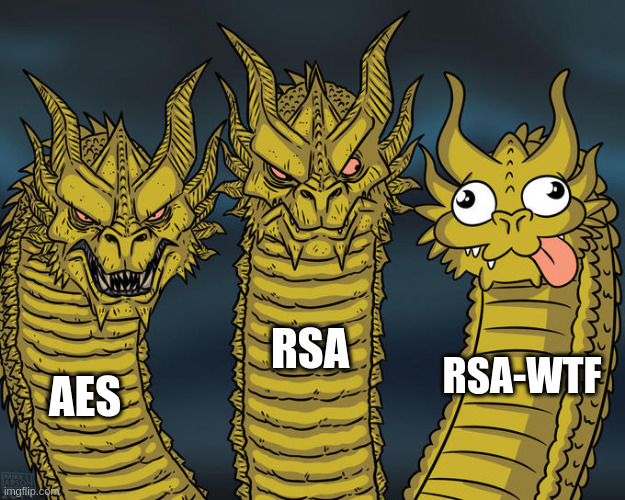

# FCSC 2025 RSA WTF

Fichiers :
- [rsa-wtf.py](rsa-wtf.py)
- [output.txt](output.txt)

Auteurs : Neige / Cryptanalyse

Origine : [RSA WTF](https://hackropole.fr/fr/challenges/crypto/fcsc2025-crypto-rsa-wtf/)

-----------

## Installation manuel
Vous n'utilisez pas l'application **les CTFs de Cyrhades** ? C'est dommage !
Mais voici comment installer ce CTF manuellement :

> git clone https://github.com/Hack-Oeil/fcsc2025-crypto-rsa-wtf.git

> cd fcsc2025-crypto-rsa-wtf

-----------

## Sur le site officiel hackropole.fr
> https://hackropole.fr/fr/challenges/crypto/fcsc2025-crypto-rsa-wtf/